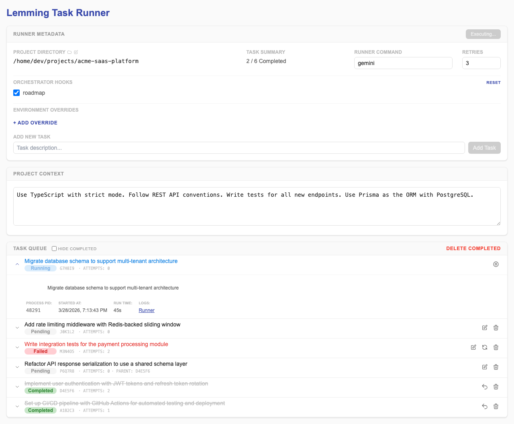
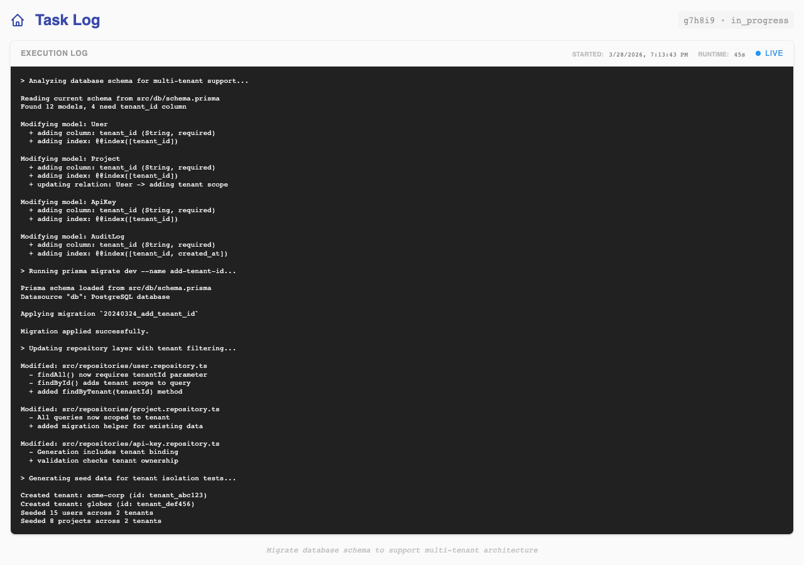

# Lemming 🐹

**The transparent, tool-agnostic orchestrator for autonomous AI coding agents.**

Lemming bridges the gap between high-level project strategy and low-level agent
execution. Instead of letting an agent wander through your codebase in a single,
massive context window, Lemming forces a structured, iterative workflow via a
human-readable `tasks.yml` file.

## Why Lemming?

- **Zero Context Drift**: By breaking projects into discrete tasks, Lemming
  ensures agents stay focused. They only see the project context, relevant
  history, and the specific task at hand.
- **Transparency & Control**: Every decision, technical finding, and outcome is
  recorded in a human-readable `tasks.yml` file. You can step in, adjust the
  roadmap, or swap agents at any time.
- **Tool Agnostic**: Lemming doesn't care which agent you use. It works
  out-of-the-box with `gemini`, `aider`, `claude`, `codex`, or even your own
  custom scripts.
- **Resilient Execution**: With built-in heartbeat monitoring, automatic
  retries, and outcome tracking, Lemming handles process crashes and rate limits
  gracefully.
- **Human-Agent Collaboration**: Use the CLI or the Web UI to collaborate with
  your agents in real-time. Mark tasks, edit descriptions, and review outcomes
  as they happen.

---

## Installation

Install globally using `uv`:

```bash
uv tool install git+https://github.com/owahltinez/lemming.git
```

## Quick Start in 3 Steps

### 1. Scaffold the Roadmap

Initialize your project context and define your goals.

```bash
# Set project-wide rules (e.g. tech stack, style guides)
lemming context "Use React, TypeScript, and Tailwind. Follow TDD."

# Add tasks to the queue
lemming add "Initialize the project with Vite"
lemming add "Create the Button component"
lemming add "Implement the authentication flow"
```

### 2. Review and Refine

See exactly what's pending and what the agent will see.

```bash
# Show the current roadmap
lemming status
```

### 3. Release the Lemming

Start the autonomous loop.

```bash
# Run using the project's configured agent (default: gemini)
lemming run

# Flags passed after -- are sent directly to the underlying runner
lemming run -- --model claude-3-5-sonnet
```

---

## The Web Dashboard

Lemming includes a modern, fast Web UI to monitor your projects.

```bash
lemming serve

# Or share it remotely via a secure tunnel with token auth
lemming serve --tunnel cloudflare
```

- **Real-time Monitoring**: Watch tasks move from pending to in-progress to
  completed.
- **Project Explorer**: A built-in, `.gitignore`-aware file browser to inspect
  your workspace alongside the roadmap. **Includes the ability to create new
  folders directly from the browser.**
- **Interactive Controls**: Add tasks, edit context, and manage the execution
  loop from your browser.

---

## How it Works

Lemming maintains a human-readable `tasks.yml` file containing your project
context, a queue of tasks, and recorded outcomes. When you run `lemming run`, it
loops through each pending task:

1.  **Build a scoped prompt**: Lemming assembles a prompt containing only the
    project context, a summary of completed tasks and their outcomes, and the
    current task description.
2.  **Invoke the agent**: It launches your chosen agent CLI with that prompt,
    monitors it with heartbeats, and streams output to a log file.
3.  **Collect results**: The agent reports back via the Lemming CLI — recording
    findings with `lemming outcome`, then marking the task with
    `lemming complete` or `lemming fail`. Agents can also schedule new tasks
    with `lemming add`, breaking down complex work into smaller steps that
    Lemming will pick up automatically.
4.  **Retry or advance**: On failure, Lemming retries the task (up to
    `--retries`) with accumulated outcomes as context, so the agent learns from
    previous attempts. On success, it moves to the next task.
5.  **Orchestration**: After each task, Lemming can run one or more
    **Orchestrator Hooks** (like the built-in `roadmap` hook) to evaluate the
    results and adapt the roadmap if needed. Hooks are enabled by default but
    can be disabled via configuration.

---

## Orchestrator Hooks ⚓️

For longer, multi-stage projects, the initial task list often can't anticipate
everything. Tasks may fail in ways that retrying won't fix, or completing all
tasks may not fully achieve the stated goal. **Orchestrator Hooks** address this
by running custom agents or scripts after each task execution to evaluate
results and adapt the roadmap.

By default, Lemming runs all available hooks (including the built-in `roadmap`
hook). You can customize this behavior via the `hooks` subcommand:

```bash
# Enable or disable hooks for the project
lemming hooks enable lint
lemming hooks disable roadmap

# Set the exact list of active hooks
lemming hooks set roadmap lint

# Reset to default (run all available hooks)
lemming hooks reset
```

### Built-in Hooks ⚓️

Lemming comes with several built-in hooks to help manage your project:

- **`roadmap`**: The primary mechanism for autonomous project management. It
  analyzes the results of the finished task and decides if the remaining roadmap
  needs to be adjusted (e.g., adding a missing prerequisite, skipping obsolete
  tasks, or breaking down a broad task).
- **`readability`**: A code quality hook that reviews changes for adherence to
  the Google Style Guide and general readability using the `readability` tool.
  It can record findings as task outcomes or suggest follow-up refactoring
  tasks.

### Custom and Global Hooks

You can create your own hooks by adding Markdown files to:

1.  **Project-specific**: `.lemming/hooks/*.md`
2.  **Global**: `~/.local/lemming/hooks/*.md`

Lemming's built-in hooks can be symlinked to the global directory using
`lemming hooks install`. This allows you to easily **override** a built-in hook
by replacing its symlink with a file, or **disable** a global override by
deleting the symlink.

Hooks follow a specific discovery precedence: **Project > Global > Built-in**.
See [DOCS/HOOKS.md](docs/HOOKS.md) for more details.

### Managing Hooks and Configuration

Use the `config` and `hooks` commands to manage your project's execution loop:

```bash
# List all available hooks (built-in and local)
lemming hooks list

# Install (symlink) built-in hooks to the global directory
lemming hooks install

# View current project configuration
lemming config list

# Persist configuration to tasks.yml
lemming config set runner aider
lemming hooks set roadmap lint
```

---

## Command Reference

### Roadmap Management

- **`status [<id>]`**: Roadmap overview or deep-dive into a specific task.
- **`context [<text>]`**: Set or view project-wide instructions. Supports
  `-f/--file`.
- **`add <desc>`**: Append a new task. Supports `--index` and `--runner`.
- **`edit <id>`**: Modify a task's description, runner, or position.
- **`delete <id>`**: Remove a task. Supports `--all` and `--completed` for bulk
  operations.
- **`outcome`**: Manage technical outcomes or findings for specific tasks.
  Supports shorthand `<id> <finding>` syntax for quick additions.
  - `list <id>`: List all outcomes for a task.
  - `add <id> <finding>`: Record a new technical detail.
  - `edit <id> <index> <text>`: Modify an existing outcome.
  - `delete <id> <index>`: Remove an outcome.
- **`config`**: Manage project configuration (runner, retries).
  - `list`: View current configuration.
  - `set <key> <value>`: Update a setting.
- **`hooks`**: Manage orchestrator hooks.
  - `list`: View available and active hooks.
  - `install`: Install built-in hooks to the global directory.
  - `enable <name>...`: Activate one or more hooks.
  - `disable <name>...`: Deactivate one or more hooks.
  - `set <name>...`: Set the exact list of active hooks.
  - `reset`: Restore default hooks (run all available).

### Task Status

- **`complete <id>`**: Mark a task as successful.
- **`fail <id>`**: Report a blocker or failure for retry.
- **`cancel <id>`**: Stop an in-progress task (kills the runner process).
- **`reset <id>`**: Clear attempts and outcomes to start a task fresh.
- **`logs [<id>]`**: Print a task's execution log to stdout. If no ID is
  provided, it defaults to the active or most recent task. Orchestrator hook
  output is automatically appended.

### Execution

- **`run`**: Start the autonomous orchestrator loop.
  - `--retry-delay`: Seconds to wait before retries (default 10).
  - `--yolo`: Run the runner in auto-approve mode (default: True).
  - `--env`: Set environment variables for the runner (e.g., `--env KEY=VALUE`).
  - `--no-defaults`: Skip default flag injection for known runners.
  - `--`: Use `--` to pass any flag directly to the underlying runner.
- **`serve`**: Launch the interactive Web UI.
  - `--port`: The port to bind the server to (default: 8999).
  - `--host`: The host address to bind the server to (default: 127.0.0.1).
  - `--tunnel cloudflare|tailscale`: Expose the UI to the public internet via a
    secure tunnel.
  - `--timeout`: Auto-shutdown after a duration (e.g., `8h`, `30m`). Defaults to
    `8h` with `--tunnel`, disabled otherwise.

---

## Advanced: Runner Customization

Lemming uses **fuzzy matching** to automatically inject the correct "YOLO"
(auto-approve) and "Quiet" flags for popular tools:

- **Gemini**: Adds `--yolo --no-sandbox`
- **Aider**: Adds `--yes --quiet`
- **Claude**: Adds `--dangerously-skip-permissions`
- **Codex**: Adds `--yolo`

You can disable this behavior with `--no-defaults`, or use a **template** to
fully control the command layout:

```bash
lemming run --runner "my-tool --input={{prompt}} --json"
```

When `{{prompt}}` is present in the runner string, Lemming replaces it with the
prompt text and skips all default flag injection.

---

## Screenshots

### Dashboard



### Task Log


