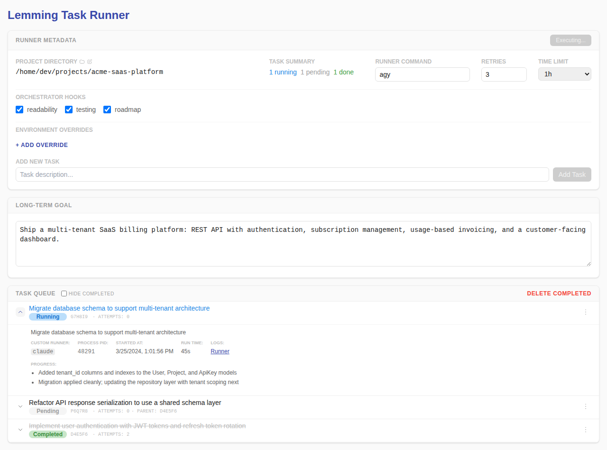
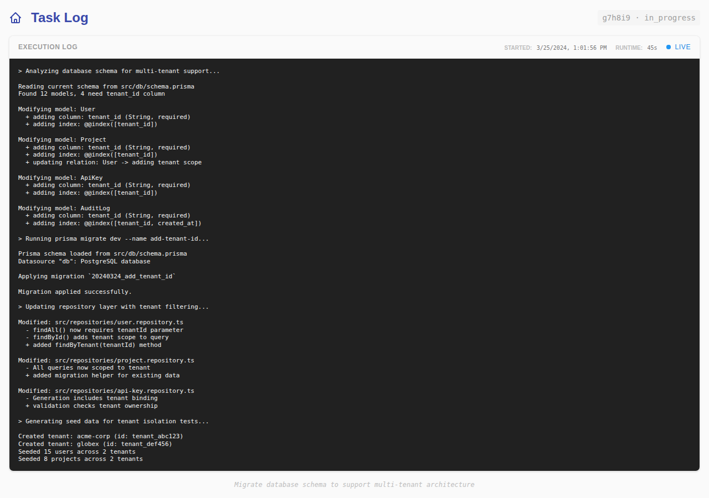

# Lemming 🐹

**The transparent, tool-agnostic orchestrator for autonomous AI coding agents.**

Lemming bridges the gap between high-level project strategy and low-level agent
execution. Instead of letting an agent wander through your codebase in a single,
massive context window, Lemming forces a structured, iterative workflow via a
human-readable `tasks.yml` file.

## Why Lemming?

- **Zero Context Drift**: By breaking projects into discrete tasks, Lemming
  ensures agents stay focused. They only see the long-term goal, relevant
  history, and the specific task at hand.
- **Transparency & Control**: Every decision, technical finding, and progress
  update is recorded in a human-readable `tasks.yml` file. You can step in,
  adjust the roadmap, or swap agents at any time.
- **Tool Agnostic**: Lemming doesn't care which agent you use. It works
  out-of-the-box with `agy`, `opencode`, `claude`, `codex`, or even your own
  custom scripts.
- **Resilient Execution**: With built-in heartbeat monitoring, automatic
  retries, and progress tracking, Lemming handles process crashes and rate
  limits gracefully.
- **Human-Agent Collaboration**: Use the CLI or the Web UI to collaborate with
  your agents in real-time. Mark tasks, edit descriptions, and review progress
  as they happen.

---

## Installation

Install globally using `uv`:

```bash
uv tool install lemming-cli
```

## Quick Start in 3 Steps

### 1. Scaffold the Roadmap

Set the long-term goal and define the first tasks.

```bash
# Set the long-term goal that every task works toward
lemming goal "Build a habit-tracking web app with auth, offline support, and tests"

# Add tasks to the queue
lemming add "Initialize the project with Vite"
lemming add "Create the Button component"
lemming add "Implement the authentication flow"
```

The goal is the one piece of state every task sees, no matter how far into the
roadmap it runs — describe what "done" looks like for the project. Durable
coding rules (tech stack, style guides) belong in your repo's agent files (e.g.
`AGENTS.md`, `CLAUDE.md`), which your agent already reads on its own.

### 2. Review and Refine

See exactly what's pending and what the agent will see.

```bash
# Show the current roadmap
lemming status
```

### 3. Release the Lemming

Start the autonomous loop.

```bash
# Run using the project's configured agent (defaults to the first
# supported runner found on PATH: agy, opencode, claude, or codex)
lemming run

# Flags passed after -- are sent directly to the underlying runner
lemming run -- --model claude-3-5-sonnet
```

---

## One-Off Tasks Without a Roadmap

`lemming exec` runs a single task and exits. It is the same agent-CLI
normalization the orchestrator uses, addressable on its own: name a task and a
runner, and the agent's closing message comes back on stdout.

```bash
# Delegate one task to a different agent, e.g. to spare another's quota
lemming exec "Fix the flaky test in runner_test.py" --runner codex

# Pipe a longer handoff instead of fighting shell quoting
cat handoff.md | lemming exec -f - --runner agy
```

With no description there is nothing for a task runner to do, so only the
reviews run — against work that already exists.

```bash
# Review uncommitted work before opening a pull request
lemming exec --review readability

# Review someone else's branch, checked out in a worktree
lemming exec -C ../review-worktree --review testing --scope main...HEAD

# Do the work, then gate it
lemming exec "Add pagination to the tasks API" --review all
```

`--scope` takes paths, which pass through untouched, or a git revision range,
which is resolved to the files it changed. It defaults to uncommitted work, or
to the whole tree outside a git repository.

Each run is self-contained: nothing is read from the project's roadmap or its
local hooks, one agent run is attempted, and the run's state directory is
removed unless it failed — in which case it is kept, and its path printed, so
the log can be read. Kept directories live in `~/.local/lemming/exec-*` and are
retired automatically a week later, so a recent failure is always still there to
inspect. Stdout carries the agent's message alone and everything else goes to
stderr, so the output can be consumed directly. Stderr reports the ephemeral
tasks file and task ID at startup; pass those to
`lemming --tasks-file <path> status <id>` or `logs <id>` to inspect an active
run. Use the global verbose flag (`lemming -v exec ...`) to stream runner
activity.

Note that the agent runs unattended (`--yolo` by default), so it does not
inherit the permission prompts of whatever launched it.

### Teaching Your Agent to Use It

Lemming ships an Agent Skill so that an agent already running — Codex, Claude
Code, Gemini CLI, Cursor — can reach any other agent CLI without knowing how
each one spells its flags. Install it once:

```bash
# Cross-tool location (~/.agents/skills), and report any tool-specific ones
lemming skill install

# Cover detected tools that require their own skill directory too
lemming skill install --all

# This repository only
lemming skill install --to .agents/skills
```

`lemming skill uninstall` reverses it. Both refuse to touch a directory that
does not hold this skill, so a mistyped `--to` fails instead of deleting work.

---

## The Web Dashboard

Lemming includes a modern, fast Web UI to monitor your projects.

```bash
lemming serve

# Or share it remotely via a secure tunnel with token auth
lemming serve --tunnel cloudflare
```

- **Real-time Monitoring**: Watch tasks move from pending to in-progress to
  completed.
- **Switch Project**: Easily switch between different projects or create new
  folders directly from the UI.
- **Browse Files**: Quickly open your workspace in a separate window to inspect
  files and directory structure alongside the roadmap.
- **Interactive Controls**: Add tasks, edit the goal, and manage the execution
  loop from your browser.

---

## How it Works

Lemming maintains a human-readable `tasks.yml` file containing your long-term
goal, a queue of tasks, and recorded progress. When you run `lemming run`, it
loops through each pending task:

1.  **Build a scoped prompt**: Lemming assembles a prompt containing only the
    long-term goal, a summary of completed tasks and their progress, and the
    current task description.
2.  **Invoke the agent**: It launches your chosen agent CLI with that prompt,
    monitors it with heartbeats, and streams output to a log file.
3.  **Collect results**: The agent reports back via the Lemming CLI — recording
    findings with `lemming progress`, then marking the task with
    `lemming complete` or `lemming fail`. Agents can also schedule new tasks
    with `lemming add`, breaking down complex work into smaller steps that
    Lemming will pick up automatically.
4.  **Retry or advance**: On failure, Lemming retries the task (up to
    `--retries`) with accumulated progress as context, so the agent learns from
    previous attempts. On success, it moves to the next task.
5.  **Orchestration**: After each task, Lemming can run one or more
    **Orchestrator Hooks** (like the built-in `roadmap` hook) to evaluate the
    results and adapt the roadmap if needed. Hooks are enabled by default but
    can be disabled via configuration.

---

## Orchestrator Hooks ⚓️

For longer, multi-stage projects, the initial task list often can't anticipate
everything. Tasks may fail in ways that retrying won't fix, or completing all
tasks may not fully achieve the stated goal. **Orchestrator Hooks** address this
by running custom agents or scripts after each task execution to evaluate
results and adapt the roadmap.

Lemming runs every hook it discovers on the filesystem (including the built-in
`roadmap` hook). Hooks are plain Markdown files, and udev-style filename
conventions control their behavior:

- **Ordering**: A numeric prefix sets the execution order (e.g. `10-lint.md`
  runs before `90-roadmap.md`); files without a prefix default to priority 50.
- **Failure hooks**: Hooks at priority 90 and above also run when a task fails;
  all others only run on success.
- **Disabling**: An empty file masks (disables) the hook of the same name from a
  lower-precedence layer.

```bash
# Disable a hook for this project (writes an empty .lemming/hooks/50-lint.md)
lemming hooks disable lint

# Re-enable it (removes the mask file)
lemming hooks enable lint
```

### Built-in Hooks ⚓️

Lemming comes with several built-in hooks to help manage your project:

- **`roadmap`**: The primary mechanism for autonomous project management. It
  analyzes the results of the finished task and decides if the remaining roadmap
  needs to be adjusted (e.g., adding a missing prerequisite, skipping obsolete
  tasks, or breaking down a broad task).
- **`readability`**: A code quality and simplification hook that challenges
  unnecessary complexity and duplicate implementations, then reviews changes for
  adherence to the Google Style Guide and general readability using the
  [readability](https://github.com/owahltinez/readability) tool (exposed as
  `lemming readability`). It can record findings as task progress or suggest
  follow-up refactoring tasks.
- **`testing`**: Verifies that changed behavior has focused test coverage and
  that the relevant tests pass.
- **`ux`**: Reviews at most one critical user journey affected by a user-visible
  change. It reports only concrete, reproducible continuity gaps and exits
  immediately for non-user-facing tasks.

### Custom and Global Hooks

You can create your own hooks by adding Markdown files to:

1.  **Project-specific**: `.lemming/hooks/*.md`
2.  **Global**: `~/.local/lemming/hooks/*.md`

To **override** a built-in hook, create a file with the same logical name (the
numeric prefix is not part of the name, so `20-roadmap.md` overrides the
built-in `90-roadmap.md` and also moves it to priority 20); delete the file to
restore the built-in version.

Hooks follow a specific discovery precedence: **Project > Global > Built-in**.
See [docs/HOOKS.md](docs/HOOKS.md) for more details.

### Managing Hooks and Configuration

Use the `config` and `hooks` commands to manage your project's execution loop:

```bash
# List all hooks in execution order, with source and status
lemming hooks list

# View current project configuration (includes the active hooks)
lemming config list

# Persist configuration to tasks.yml
lemming config set runner opencode
```

### Evaluating Prompt Changes

Editing a hook prompt can regress behavior without any test failing. The
containerized eval harness replays realistic scenarios against the real hook
execution path and grades the outcome mechanically:

```bash
uv run python -m lemming.evals run --suite roadmap
```

See [docs/EVALS.md](docs/EVALS.md) for details.

---

## Command Reference

### Global Options

These come before the subcommand and apply to all of them.

- **`-C, --project-dir <dir>`**: Run as if invoked from `<dir>`, addressing that
  project's roadmap. Relative paths in other options resolve against it. See
  [Working across projects](#working-across-projects).
- **`--tasks-file <path>`**: Point at a specific tasks file instead of the one
  derived from the current directory.
- **`-v, --verbose`**: Show verbose output.

### Roadmap Management

- **`status [<id>]`**: Queue/history overview or deep-dive into a specific task,
  including supersession lineage, the last resolved runner command, and
  runner/orchestrator-hook execution times. Superseded and failed history stays
  visible in the default overview; `--verbose` also shows routine
  completed/cancelled history.
  - `--json`: Emit machine-readable JSON instead of formatted text, so scripts
    never have to parse the internal state file.
  - `--brief`: Omit task descriptions, which otherwise dominate the output.
- **`goal [<text>]`**: Set or view the long-term goal shared by all tasks.
  Supports `-f/--file`.
- **`add <desc>`**: Append a new task. Supports `--index`, `--runner`, and
  `--model`.
- **`edit <id>`**: Modify a task's description, runner, model, or position.
- **`brief <id> [text]`**: View or set a task's long-form brief. Unlike the
  description it has no length cap, and it is appended to the runner prompt
  automatically — the right home for measured timings, exact failing selectors,
  or why a previous attempt was wrong. Supports `-f/--file`.
- **`delete <id>`**: Remove an unstarted task while retaining its runner log.
  Tasks with execution history require `--force`; autonomous restructuring
  should use `supersede`. Supports `--all` and `--completed` for bulk cleanup,
  including logs.
- **`supersede <id> --reason <text>`**: Retire a replaced or split task without
  losing its progress, timings, log, or links to replacement tasks.
- **`progress`**: Manage progress entries and findings for specific tasks.
  - `list <id>`: List all progress for a task.
  - `add <id> <finding>`: Record a new technical detail.
  - `edit <id> <index> <text>`: Modify an existing progress entry.
  - `delete <id> <index>`: Remove a progress entry.
- **`config`**: Manage project configuration (runner, model, retries, time
  limit).
  - `list`: View current configuration.
  - `set <key> <value>`: Update a setting. `set model default` clears a pinned
    model without touching the runner.
- **`hooks`**: Manage orchestrator hooks.
  - `list`: View available and active hooks.
  - `install`: Install built-in hooks to the global directory.
  - `enable <name>...`: Activate one or more hooks.
  - `disable <name>...`: Deactivate one or more hooks.
  - `set <name>...`: Set the exact list of active hooks.
  - `reset`: Restore default hooks (run all available).
- **`readability`**: Code quality tool for style guide adherence, wrapping the
  [readability](https://github.com/owahltinez/readability) package. Ruff and
  Pyrefly run with bundled Google-style defaults unless the target project
  defines its own configuration.
  - `check <paths>...`: Run formatters and linters.
  - `guide <language>`: Fetch and view style guides.
  - `languages`: List all supported languages.
  - `sync`: Synchronize style guides from the web.

### Task Status

- **`complete <id>`**: Mark a task as successful.
- **`fail <id>`**: Mark a task as a terminal failure (will not be retried).
- **`cancel <id>`**: Stop an in-progress task (kills the runner process).
- **`reset <id>`**: Clear attempts and progress to start a task fresh.
- Superseded tasks remain visible as non-failing history; replacement tasks link
  back through their parent task ID.
- **`logs [<id>]`**: Print a task's execution log to stdout, including retained
  logs for removed tasks. If no ID is provided, it defaults to the active or
  most recent task. Orchestrator hook output is automatically appended. Supports
  `--json` to wrap the log with its task ID and path.

### Execution

- **`run`**: Start the autonomous orchestrator loop.
  - `--retry-delay`: Seconds to wait before retries (default 10).
  - `--yolo`: Run the runner in auto-approve mode (default: True).
  - `--env`: Set environment variables for the runner (e.g., `--env KEY=VALUE`).
  - `--no-defaults`: Skip default flag injection for known runners.
  - `--`: Use `--` to pass any flag directly to the underlying runner. A
    per-task `--runner`/`--model` overrides anything passed here.
- **`exec [<description>]`**: Run one task, or one set of reviews, outside any
  roadmap. Prints the agent's closing message to stdout and everything else to
  stderr, including its tasks file and task ID at startup. Use
  `lemming -v exec ...` to stream runner activity. Exits non-zero if the task
  did not complete. See [One-off tasks](#one-off-tasks-without-a-roadmap).
  - `-f/--file`: Read the description from a file, or `-` for stdin. Unlike
    `add`, there is no length cap.
  - `--review <names>`: Reviews to run after the task, comma-separated or
    repeated; `all` selects every one. With no description, only the reviews
    run. Hooks that revise the roadmap cannot be selected.
  - `--scope <path|range>`: What the reviews look at. Paths pass through; a git
    revision range is resolved to the files it changed. Defaults to uncommitted
    work, or the whole tree outside a repository.
  - `--runner`, `--model`: Which agent CLI and model to use.
  - `--time-limit`: Minutes before the agent is killed (default 60, 0 for no
    limit).
  - `--yolo/--no-yolo`: Run the agent unattended (default: True).
  - `--keep`: Keep the run's state directory even when it succeeds.
- **`skill install`**: Install the packaged Agent Skill so agents discover
  Lemming. Writes to `~/.agents/skills` by default and names any tool-specific
  directories it found.
  - `--to <dir>`: Install into a specific skills directory.
  - `--all`: Also cover every detected tool's own skills directory.
  - `--link`: Symlink instead of copying, so upgrades take effect immediately.
  - `--force`: Replace an existing installation of this skill.
  - `--dry-run`: Print what would happen, refusals included.
- **`skill uninstall`**: Remove it again. Same `--to`, `--all`, and `--dry-run`.
- **`stop`**: Stop the running loop and its runner.
  - `--after-current-task`: Drain instead — let the running task finish, then
    stop before claiming another. This is the safe way to change the runner or
    model without stranding work in flight.
- **`serve`**: Launch the interactive Web UI.
  - `--port`: The port to bind the server to (default: 8999).
  - `--host`: The host address to bind the server to (default: 127.0.0.1).
  - `--tunnel cloudflare|tailscale`: Expose the UI to the public internet via a
    secure tunnel.
  - `--timeout`: Auto-shutdown after a duration (e.g., `8h`, `30m`). Defaults to
    `8h` with `--tunnel`, disabled otherwise.

---

## Working across projects

When work on one project turns up something that belongs to another — a bug in a
dependency you also maintain, a doc fix in a sibling repo — file it directly on
that project's roadmap with `-C` instead of routing it through an external issue
tracker:

```bash
# From inside project A, queue work on project B
lemming -C ~/src/other-project add "check --fix drops the trailing newline"

# Attach the evidence; the brief has no length cap
lemming -C ~/src/other-project brief <id> --file repro.md

# Read the other project's roadmap without leaving yours
lemming -C ~/src/other-project status
```

`-C` works whether or not the target keeps a `tasks.yml` in its repo, so you
never have to know where its isolated state lives. Because it changes the
working directory, everything else follows too: the target's `.env`, its
`.lemming/hooks`, and the directory the runner executes in.

When an agent files a task this way from inside a `lemming run`, the new task
records the task it came from via `parent` and `parent_tasks_file`. The
downstream runner then sees a **Parent Task Context** section in its prompt
describing why the work was requested, so the report doesn't lose its origin.

---

## Advanced: Runner Customization

Lemming uses **fuzzy matching** to automatically inject the correct "YOLO"
(auto-approve) and "Quiet" flags for popular tools:

- **Antigravity (`agy`)**: Adds `--dangerously-skip-permissions` and exposes the
  project workspace with `--add-dir`
- **OpenCode**: Runs non-interactively via `opencode run`, adds `--format json`,
  and, in YOLO mode, adds `--auto`. For its Google provider, Lemming makes an
  existing `GOOGLE_API_KEY` or `GEMINI_API_KEY` available under OpenCode's
  native `GOOGLE_GENERATIVE_AI_API_KEY` name.
- **Claude**: Adds `--dangerously-skip-permissions`
- **Codex**: Runs non-interactively via `codex exec`, adds `--json`, and, in
  YOLO mode, adds `--dangerously-bypass-approvals-and-sandbox`

### Choosing a model

The model is a first-class setting, separate from the runner, so switching
provider does not silently discard it:

```bash
lemming config set model gemini-3.6-flash-high   # project default
lemming add "Fix the flaky test" --model fast    # just this task
lemming config set model default                 # let the runner decide
```

Precedence, highest first: an explicit `--model` inside a runner string, the
task's `--model`, the project's `config model`, then anything passed after
`lemming run --`. A per-task setting always wins over the loop-wide passthrough
— the conflicting global flag is dropped rather than duplicated on the command
line.

### Runner strings

A runner is not limited to a binary name: any extra arguments in the string are
appended to the command, which is another way to pin per-task behaviour.

```bash
lemming add "Try the fast model" --runner "agy --model fast"
```

You can disable default flag injection with `--no-defaults` (`codex exec`
remains the Codex execution interface), or use a **template** to fully control
the command layout:

```bash
lemming config set runner "my-tool --input={{prompt}} --json"
```

When `{{prompt}}` is present in the runner string, Lemming replaces it with the
prompt text and skips all default flag injection.

### Knowing what actually ran

Each attempt records the command it launched, with the prompt elided, so the
runner and model behind a finished task stay recoverable:

```bash
lemming status <id>          # includes "Last Command:"
lemming status --json        # same data, machine-readable
```

---

## Releasing

Releases are published to PyPI as
[`lemming-cli`](https://pypi.org/project/lemming-cli/) via trusted publishing:
pushing a `v*` tag triggers the `publish.yml` GitHub Actions workflow, which
builds the package with `uv build` and uploads it.

```bash
# 1. Bump pyproject.toml and uv.lock together, commit, and push
uv version --bump patch --no-sync
version="$(uv version --short)"
git add pyproject.toml uv.lock
git commit -m "Bump version to $version"
git push origin main

# 2. After CI passes, tag the release and push the tag
git tag "v$version"
git push origin "v$version"
```

---

## Screenshots

These are regenerated automatically by CI whenever the web UI changes (see
`.github/workflows/screenshots.yml`); run `npm run screenshots` to preview them
locally.

### Dashboard



### Task Log


